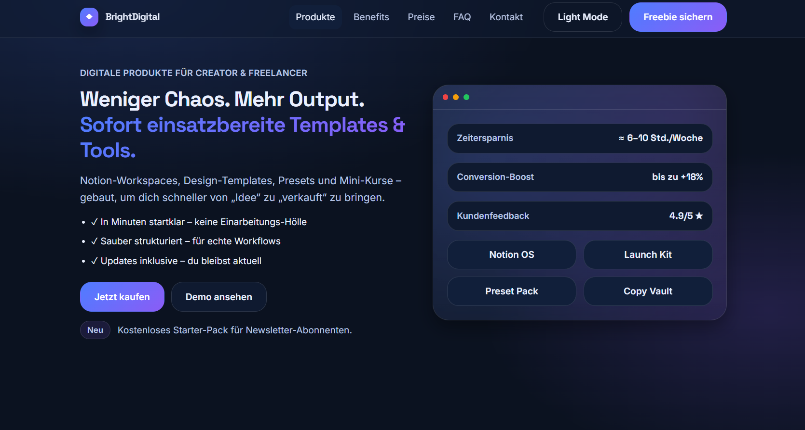
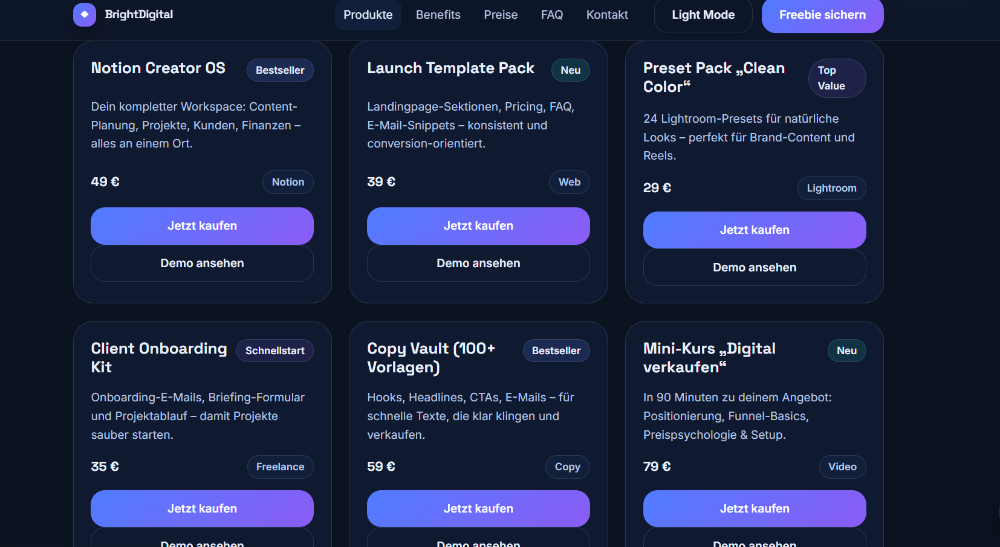
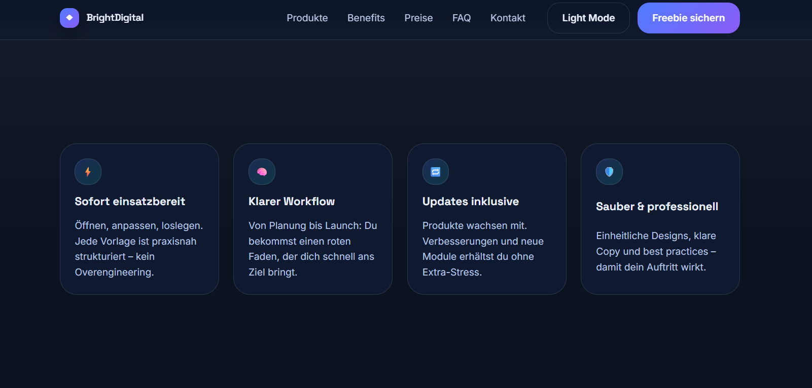

# BrightDigital Landingpage


Eine moderne, responsive Produkt-Landingpage für **digitale Produkte** wie Templates, Notion-Workspaces, Presets und Mini-Kurse.  
Das Projekt wurde mit **HTML, CSS und JavaScript** umgesetzt und kann lokal direkt im Browser oder unter **Ubuntu mit Apache2 auf localhost** ausgeführt werden.

---

## Vorschau

> Hier kann später ein Screenshot der Startseite eingefügt werden.

### Beispiel für GitHub-Vorschau
Lege einen Screenshot z. B. unter `assets/preview.png` ab und aktiviere dann diese Zeile:

```md

## Screenshots

### Startseite


### Angebot


### Mehrwert


```

---

## Inhalt

- [Schnellstart](#schnellstart)
- [Ubuntu + Apache2 Anleitung](#ubuntu--apache2-anleitung)
- [Projektziel](#projektziel)
- [Funktionen](#funktionen)
- [Projektaufbau](#projektaufbau)
- [Technischer Aufbau](#technischer-aufbau)
- [Repository-Struktur](#repository-struktur)
- [GitHub-Upload](#github-upload)
- [Anpassungen](#anpassungen)

---

## Schnellstart

### Variante 1: Direkt im Browser öffnen
Da es sich um ein Frontend-Projekt ohne Backend handelt, kann die Webseite direkt lokal geöffnet werden:

1. Alle Dateien in einen Ordner legen:
   - `index.html`
   - `styles.css`
   - `script.js`
2. `index.html` mit einem Browser öffnen.

### Variante 2: Über einen lokalen Webserver
Empfohlen, wenn du das Projekt realistischer testen möchtest.

#### Mit Python (falls installiert)
```bash
python3 -m http.server 8000
```
Dann im Browser öffnen:

```bash
http://localhost:8000
```

---

## Ubuntu + Apache2 Anleitung

Diese Anleitung passt gut zu deiner Aufgabe mit **Ubuntu in VirtualBox** und **Ausschließlich Terminal**.

### 1. Apache2 installieren
```bash
sudo apt update
sudo apt install apache2 -y
```

### 2. Apache2 starten und Status prüfen
```bash
sudo systemctl start apache2
sudo systemctl enable apache2
sudo systemctl status apache2
```

Wenn Apache läuft, erreichst du die Standardseite unter:

```bash
http://localhost
```

### 3. Projektdateien in das Webverzeichnis kopieren
Standard-Webverzeichnis von Apache:

```bash
/var/www/html
```

Projektdateien dorthin kopieren:

```bash
sudo cp index.html /var/www/html/
sudo cp styles.css /var/www/html/
sudo cp script.js /var/www/html/
```

### 4. Rechte setzen
```bash
sudo chown -R $USER:$USER /var/www/html
sudo chmod -R 755 /var/www/html
```

### 5. Webseite im Browser testen
```bash
http://localhost
```

### 6. Falls noch die Apache-Standardseite angezeigt wird
Alte Standarddatei entfernen:

```bash
sudo rm /var/www/html/index.html
```

Danach deine eigene `index.html` erneut kopieren:

```bash
sudo cp index.html /var/www/html/
```

### 7. Apache neu laden
```bash
sudo systemctl reload apache2
```

---

## Projektziel

Die Webseite stellt ein fiktives digitales Produktangebot unter dem Namen **BrightDigital** dar.  
Ziel der Seite ist es, digitale Produkte professionell zu präsentieren und Besucher zu einer Aktion zu führen, zum Beispiel:

- Produkte ansehen
- Preise vergleichen
- Newsletter abonnieren
- Kontakt aufnehmen
- ein Angebot oder Bundle auswählen

Die Seite eignet sich als:

- Demo-Landingpage für Webentwicklung
- Übungsprojekt für HTML/CSS/JavaScript
- Vorlage für ein späteres echtes Verkaufsprojekt
- Beispielprojekt für Hosting mit Apache2 auf Ubuntu

---

## Funktionen

Die Webseite enthält mehrere typische Bestandteile einer modernen Landingpage:

### Inhaltlich
- Hero-Bereich mit Hauptbotschaft und Call-to-Action
- Produktkarten mit Preisen und Kategorisierung
- Benefits / Vorteile
- Social-Proof / Vertrauenselemente
- Pricing-Bereich mit mehreren Paketen
- FAQ-Sektion
- Newsletter-Bereich mit Lead-Magnet
- Kontaktbereich mit Formular
- Footer mit rechtlichen Platzhaltern

### Technisch
- Responsive Navigation
- Mobile-Menü mit Toggle-Button
- Smooth Scrolling zu Abschnitten
- Aktive Menü-Markierung beim Scrollen
- Reveal-on-Scroll Animationen
- Back-to-top Button
- Light-/Dark-Mode Umschaltung
- Speicherung des Themes per `localStorage`
- Formularvalidierung im Browser
- Erfolgsnachricht nach dem Absenden der Demo-Formulare
- Automatische Jahresanzeige im Footer per JavaScript

---

## Projektaufbau

Die Seite ist als **Single-Page-Landingpage** aufgebaut.  
Alle wichtigen Inhalte liegen auf einer Seite und sind über die Navigation erreichbar.

### Hauptabschnitte
1. **Header / Navigation**  
   Enthält Logo, Menüeinträge und den Theme-Toggle.

2. **Hero Section**  
   Erster sichtbarer Bereich mit Nutzenversprechen und Buttons.

3. **Produkte**  
   Vorstellung mehrerer digitaler Produkte in Kartenform.

4. **Benefits**  
   Argumente, warum die Produkte hilfreich sind.

5. **Social Proof**  
   Vertrauenselemente wie Bewertungen oder Kundenzufriedenheit.

6. **Pricing**  
   Preisübersicht mit verschiedenen Paketen.

7. **FAQ**  
   Häufige Fragen mit `<details>` und `<summary>`.

8. **Newsletter**  
   Formular für Lead-Magnet / Freebie.

9. **Kontakt**  
   Formular für Anfragen.

10. **Footer**  
    Copyright, Impressum und Datenschutz als Platzhalter.

---

## Technischer Aufbau

### HTML
Die `index.html` bildet die komplette Struktur der Landingpage.

Verwendet wurden unter anderem:
- semantische Bereiche wie `header`, `main`, `section`, `footer`
- zugängliche Navigation
- Formularfelder mit Labels
- `details` / `summary` für die FAQ
- Data-Attribute zur gezielten JavaScript-Steuerung

### CSS
Die `styles.css` sorgt für:
- Layout
- Farbsystem
- Abstände
- Typografie
- Karten-Design
- Buttons
- Formulare
- Responsivität
- Theme-Variablen für Light- und Dark-Mode

Das Styling ist modular aufgebaut und nutzt:
- CSS Custom Properties
- Grid-Layouts
- Media Queries
- Übergänge und visuelle Effekte
- saubere Komponentenklassen

### JavaScript
Die `script.js` übernimmt die Interaktivität der Seite:

- Navigation öffnen/schließen
- Scroll-Verhalten verbessern
- sichtbaren Abschnitt im Menü markieren
- Elemente beim Scrollen einblenden
- Theme wechseln
- Theme in `localStorage` speichern
- Formulare validieren
- Demo-Erfolgsmeldungen anzeigen
- Jahreszahl automatisch setzen

Wichtig:  
Die Formulare besitzen **keine echte Backend-Anbindung**. Das Absenden ist aktuell eine Frontend-Demo.

---

## Repository-Struktur

```text
brightdigital-landingpage/
├── index.html
├── styles.css
├── script.js
└── README.md
```

Erweiterbar zum Beispiel um:

```text
brightdigital-landingpage/
├── assets/
│   ├── preview.png
│   └── icons/
├── index.html
├── styles.css
├── script.js
└── README.md
```

---

## GitHub-Upload

Falls du das Projekt in ein Git-Repository hochladen willst:

### 1. Repository initialisieren
```bash
git init
```

### 2. Dateien hinzufügen
```bash
git add .
```

### 3. Ersten Commit erstellen
```bash
git commit -m "Initial commit: BrightDigital landingpage"
```

### 4. Branch auf `main` setzen
```bash
git branch -M main
```

### 5. Remote Repository verbinden
```bash
git remote add origin git@github.com:DEIN-USERNAME/DEIN-REPOSITORY.git
```

### 6. Hochladen
```bash
git push -u origin main
```

---

## Anpassungen

Diese Inhalte kannst du leicht ändern:

### Texte anpassen
Alle Texte befinden sich direkt in der `index.html`.

### Farben anpassen
Farben und Theme-Variablen befinden sich in der `styles.css`.

### Funktionen erweitern
Interaktive Logik befindet sich in der `script.js`.

Sinnvolle nächste Schritte wären:
- echte Formularverarbeitung mit PHP, Node.js oder einem Formularservice
- Stripe- oder PayPal-Anbindung
- echte Social-Links
- Impressum und Datenschutz ergänzen
- Produktbilder oder Mockups einfügen
- SEO-Meta-Tags weiter ausbauen

---

## Hinweis

Dieses Projekt ist eine **statische Frontend-Webseite**.  
Es benötigt aktuell **keine Datenbank** und **keinen Servercode**, außer wenn du später echte Formulare, Login oder Zahlungsfunktionen ergänzen möchtest.

---

## Autor

Erstellt als Webprojekt mit:
- HTML5
- CSS3
- JavaScript
- getestet / ausführbar auf Ubuntu mit Apache2

